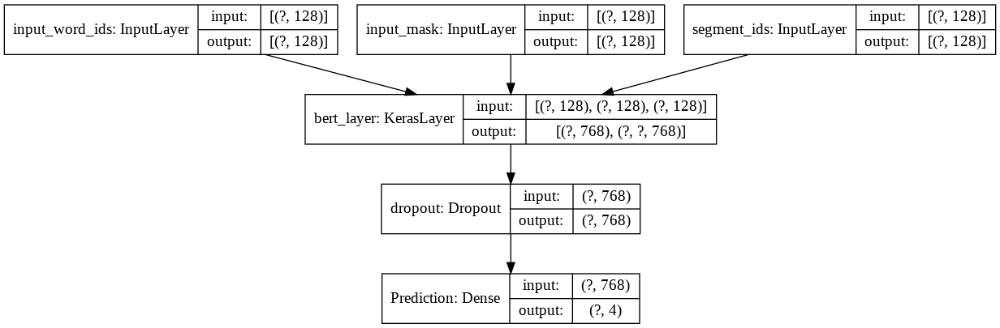
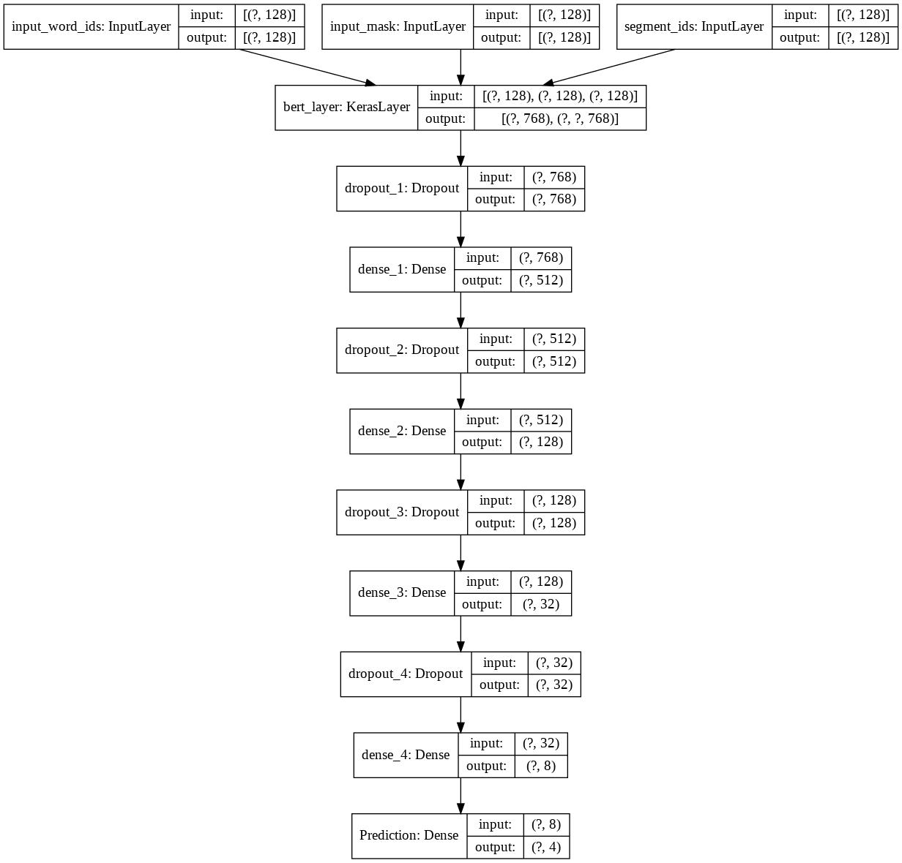
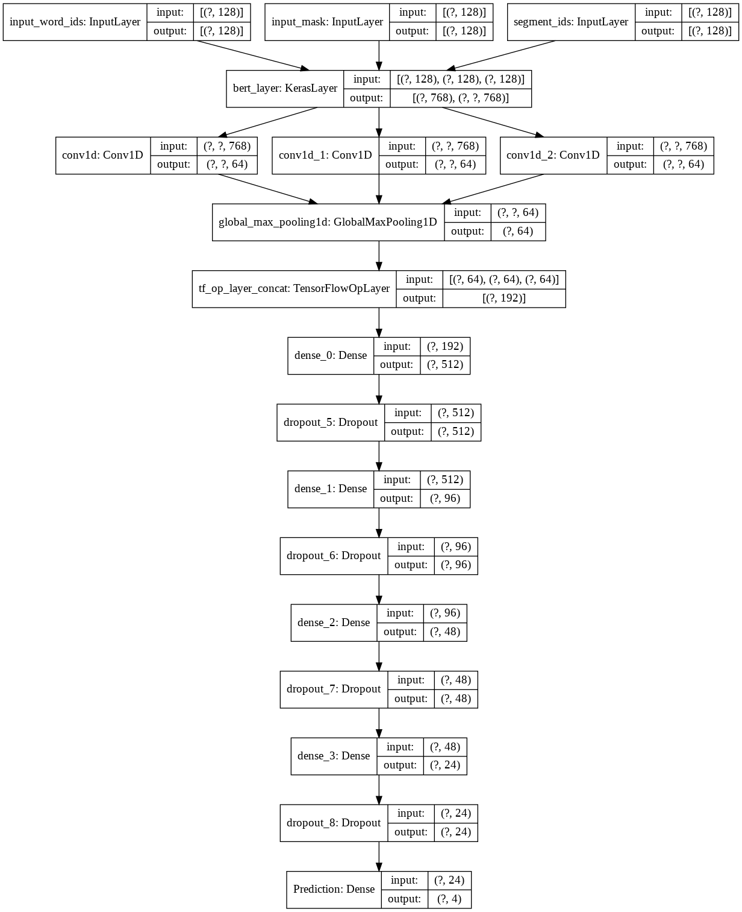
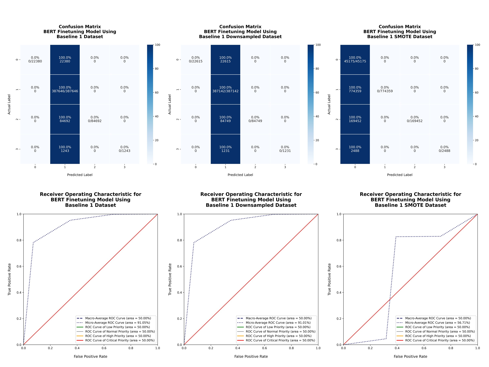
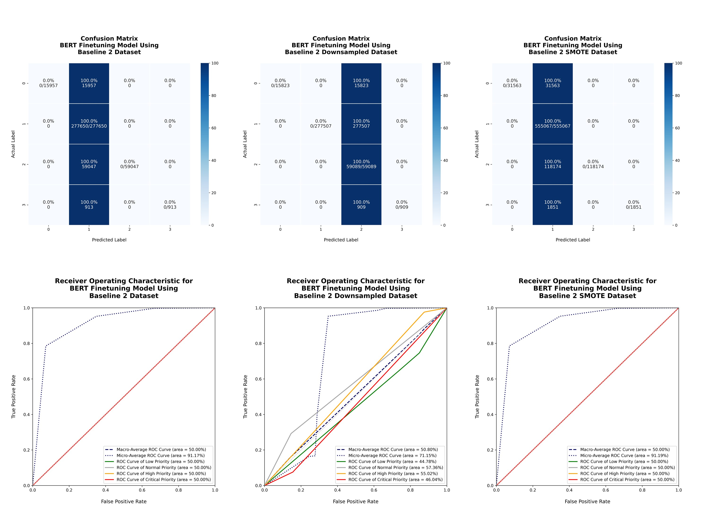
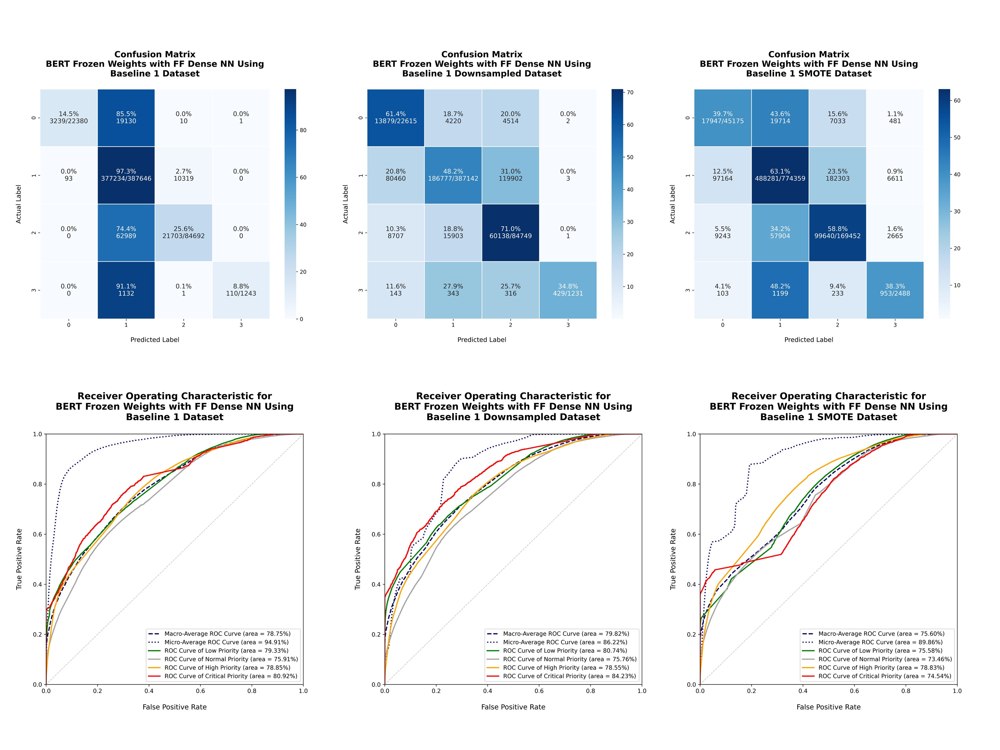
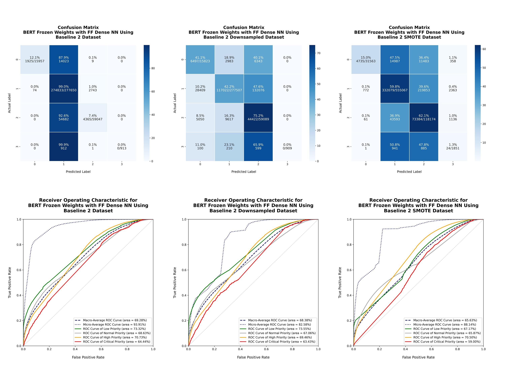
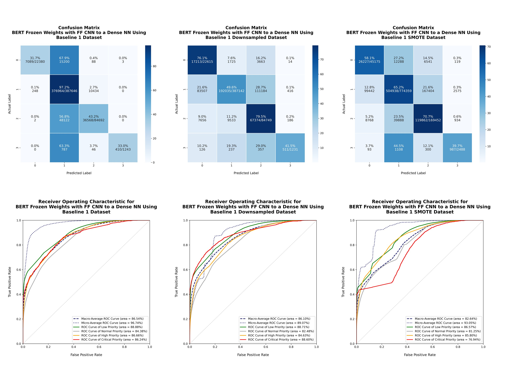
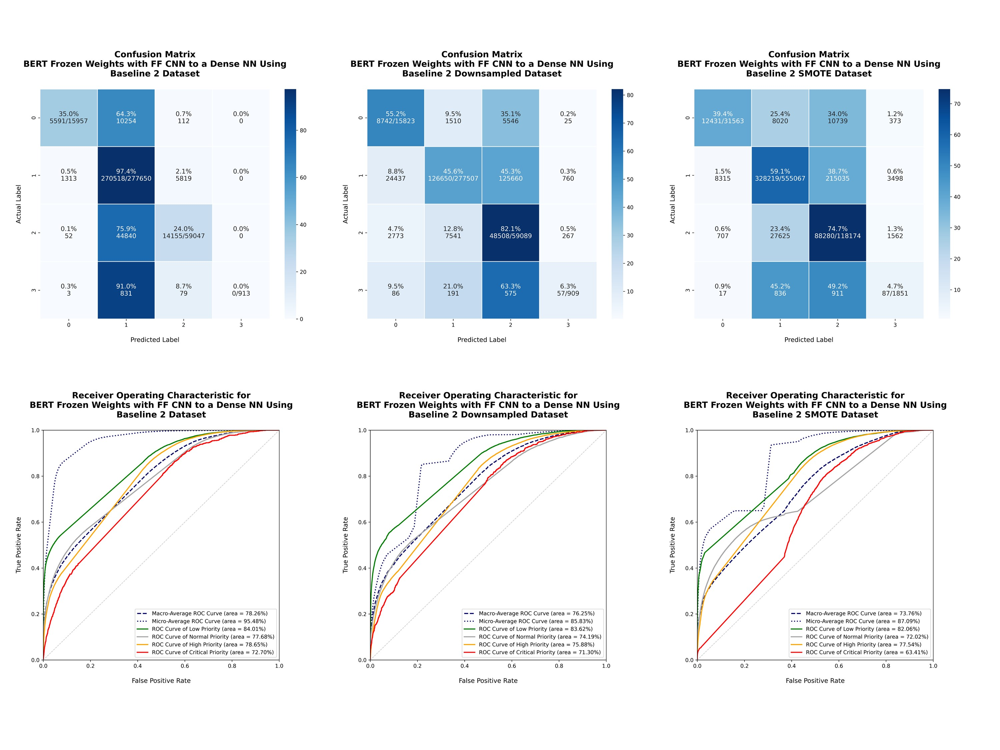

# W266 Final Project
## Predicting Software Support Ticket Criticality Using Sparse Imbalanced Data and NLP
### April 20, 2020
* Nick Sylva
* Matt Kane
* Elena Petrov

## Folder Structure
* **final_paper:** Final paper
* **img:** images
* **notebooks:** Colab Jupyter Notebooks
* **papers:** Academic papers and references
* **sample_dataset:** Sample dataset
* **src:** Python code

## Final Paper

## Problem Statement
* Create a screening tool for incoming email support requests that predicts the severity of the issue to facilitate support ticket triage before a human can read the support email.

## Dataset
* Real business dataset spanning 6,000 clients, 425,000 tickets,and ~2.7 million ticket actions over the last 10 years
* Sourced from Greenshades, a payroll and employee services software provider for SMBs
* Raw data was ~4.3GB in CSV format

## Dataset Considerations
* Large dataset
* Thorough data cleansing
* Semantic augmentation
* Multi-class classification problem with highly imbalanced dataset

## Model Specifications

### Model 1: Simple Classifier with BERT Fine Tuning
* Simplest model
* BERT to single Dense layer
* Sequence representation
* Examine effectiveness of fine-tuning

#### Model 1 Diagram

### Model 2: Frozen BERT and Dense NN
* Frozen BERT: no fine-tuning
* Sequence representation
* 4 dense layers
* Examine if dense network can pick up features better than BERT fine-tuning alone

#### Model 2 Diagram

### Model 3: Frozen BERT, CNN, and Dense NN
* Frozen BERT: no fine-tuning
* Full embeddings for each token
* Passed through three filter sizes of 64 filters each to pooling, concatenation, and dense network
* Pick up on relationships between token embeddings

#### Model 3 Diagram

## Results

### Model 1: Simple Classifier with BERT Fine Tuning
#### Baseline 1: Regular Normalization

#### Baseline 2: Semantic Augmentation

### Model 2: Frozen BERT and Dense NN
#### Baseline 1: Regular Normalization

#### Baseline 2: Semantic Augmentation

### Model 3: Frozen BERT, CNN, and Dense NN
#### Baseline 1: Regular Normalization

#### Baseline 2: Semantic Augmentation

